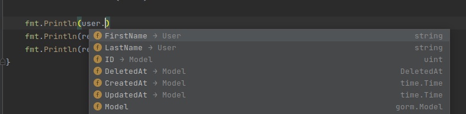

# 使用gorm做自動遷移table

gorm可以使用struct model來自動建立出對應的table

```go
type User struct {
	gorm.Model
	FirstName string
	LastName  string
}
...
...
db.AutoMigrate(&User{})
```

可以透過log看下實際打到pg的語句是啥


```sql
CREATE TABLE "gorm_test"."user" ("id" bigserial,"created_at" timestamptz,"updated_at" timestamptz,"deleted_at" timestamptz,"first_name" text,"last_name" text,PRIMARY KEY ("id"))

CREATE INDEX IF NOT EXISTS "idx_gorm_test_user_deleted_at" ON "gorm_test"."user" ("deleted_at")
```


可以發現gorm.Model這個欄位會自個欄位動建出3個欄位

* "id" bigserial
  * PK
* "created\_at" timestamptz
* "updated\_at" timestamptz
* "deleted\_at" timestamptz

還會替deleted\_at建索引

此外可以看到gorm struct對於column name有預設的轉換規則, 就是把駝峰命名轉換為底線命名,跟node.js的sequelize一樣, 可以避免一些db對於大小寫沒區分的規則


這裡補充一個跟go有關的東西, 就是User struct裏頭, 為什麼有一個沒匿名 (`gorm.Model`) 的欄位呢? 在go中這叫嵌入(Embedding)模式, 可以把該嵌入的struct在外層攤平, 來看看`gorm.Model`就知道了

```go
type Model struct {
	ID        uint `gorm:"primarykey"`
	CreatedAt time.Time
	UpdatedAt time.Time
	DeletedAt DeletedAt `gorm:"index"`
}
```

接著透過IDE觀察攤平是什麼效果



所以說, 如果你不想要gorm預設幫你加delete欄位, 你可以自己建一個Embedding struct, 應該就可以辦到


完整代碼

```go
package main

import (
	"fmt"
	"gorm.io/driver, /postgres"
	"gorm.io/gorm"
	"gorm.io/gorm/logger"
	"gorm.io/gorm/schema"
)

type User struct {
	gorm.Model
	FirstName string
	LastName  string
}

func automigrateTest() {
	host := "localhost"
	user := "postgres"
	password := "admin"
	dbname := "postgres"
	port := "5432"
	applicationName := "gorm-play"
	poolSize := 5
	schemaName := "gorm_test"

	dsn := fmt.Sprintf("host=%s user=%s password=%s dbname=%s port=%s application_name=%s",
		host,
		user,
		password,
		dbname,
		port,
		applicationName)

	db, err := gorm.Open(postgres.Open(dsn), &gorm.Config{
		Logger: logger.Default.LogMode(logger.Info),
		NamingStrategy: schema.NamingStrategy{
			TablePrefix:   schemaName + ".",
			SingularTable: true,
		},
	})
	if err != nil {
		fmt.Println(err)
	}

	sqlDB, err := db.DB()
	if err != nil {
		fmt.Println(err)
	}

	sqlDB.SetMaxIdleConns(poolSize)
	sqlDB.SetMaxOpenConns(poolSize)

	db.Exec("CREATE SCHEMA IF NOT EXISTS " + schemaName)

	db.AutoMigrate(&User{})
}

```
